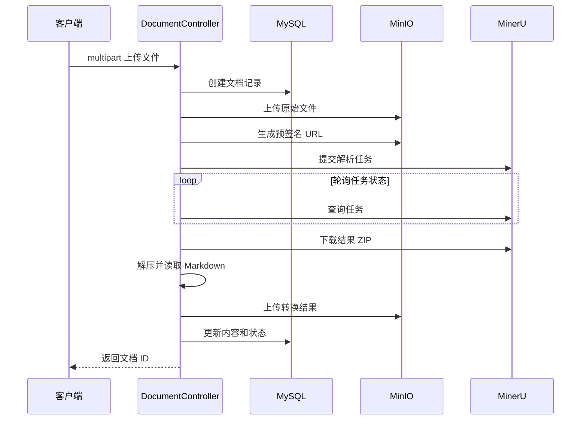
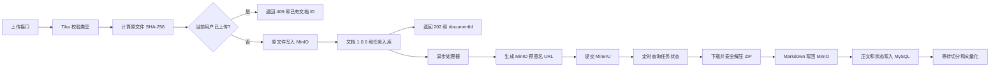
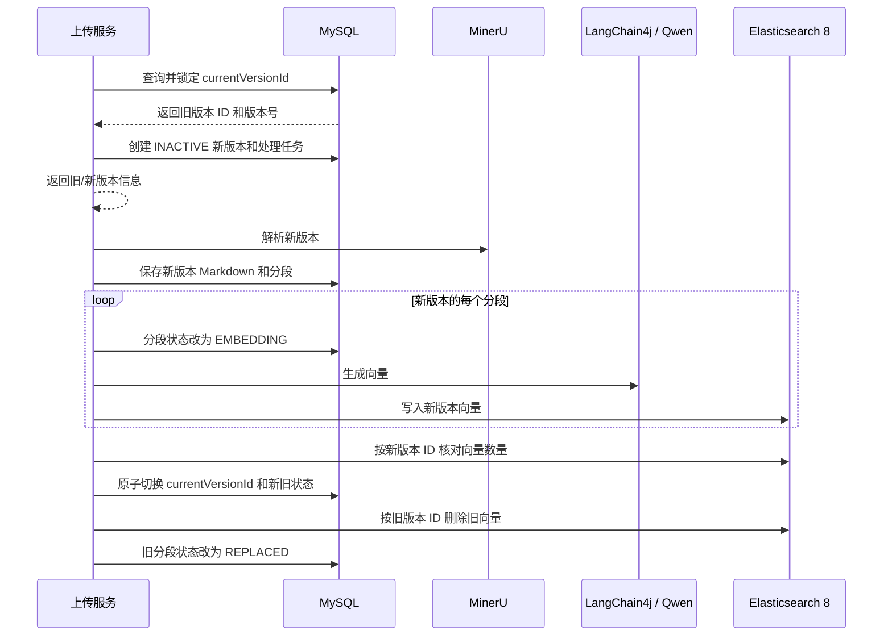
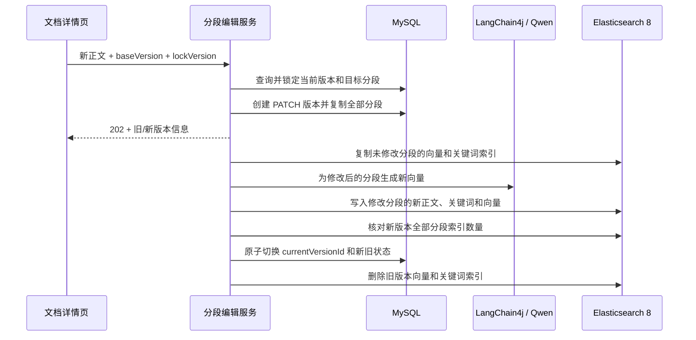

# 文档上传与 MinerU 中间处理设计方案

## 1. 目标

为 `know-engine` 设计一条文档上传链路：

1. 用户上传原始文档。
2. 计算原始文件 SHA-256，并判断当前用户是否已经上传过相同文件。
3. 不重复时将原始文件保存到 MinIO，首次版本固定为 `1.0.0`。
4. 使用 MinIO 预签名 URL 将文档交给 MinerU 解析。
5. 获取 MinerU 输出的 ZIP，提取 Markdown。
6. 将转换后的 Markdown 保存到 MinIO，并把正文和版本信息写入 MySQL。
7. 后续修改以不可变新版本继续迭代，切分、向量化和 Elasticsearch 索引基于转换后的 Markdown 处理。
8. 模型能力统一通过 LangChain4j 接入，本期向量模型使用 Qwen，避免业务代码直接依赖模型供应商 HTTP 协议。

本文同时作为实施约束。当前已开始实现 Controller、统一文档 Service、异步中间处理器、基础设施适配器和前端页面；后续修改仍以本文的数据边界、幂等和版本规则为准。

## 2. 参考实现

参考文件：

```text
F:/java-study/blog/blog-knowledge/src/main/java/
  cn/cosx/blog/knowledge/document/controller/DocumentController.java
```

参考项目的主要流程为：



核心思路可以复用，但不直接复制以下实现方式：

- 不由客户端传入 `uploadUser`，上传人必须来自 Sa-Token 和 `UserContextHolder`。
- 不在 Controller 中捕获所有异常，统一交给全局异常处理。
- 不在 HTTP 请求线程中最长轮询 30 分钟。
- 原文件只上传一次，不再为了 MinerU 重复上传到临时目录。
- 不记录包含签名参数的 MinIO URL，也不记录 MinerU token。
- 不直接拼接 ZIP entry 路径，必须阻止 Zip Slip 和 ZIP 炸弹。
- 解析失败不能把状态重置为 `INIT`，应保留明确的失败状态和原因。

## 3. 推荐架构

采用“上传请求同步完成入库，MinerU 解析异步执行”的方式。



这样设计的原因：

- MinerU 解析时间不确定，异步模式不会长期占用 Tomcat 请求线程。
- 服务重启后可以依据数据库任务状态继续轮询。
- 上传、解析、切分和向量化可以独立失败、重试和观察。
- 后续更换解析供应商时，不需要修改上传接口和文档实体。

## 4. 接口草案

### 4.1 上传文档

```http
POST /api/v1/knowledge-documents/upload
Content-Type: multipart/form-data
Authorization: Bearer <token>
```

表单字段：

| 字段 | 类型 | 必填 | 说明 |
| --- | --- | --- | --- |
| `file` | file | 是 | 原始文档 |
| `documentName` | string | 否 | 文档名称，未传时使用原文件名 |

上传人不作为请求参数，由 `UserContextHolder.requireCurrentUser()` 获取。

建议响应状态为 `202 Accepted`：

```json
{
  "code": 0,
  "message": "success",
  "data": {
    "documentId": "2096000000000000001",
    "documentVersionId": "2096000000000000002",
    "version": "1.0.0",
    "status": "uploaded"
  }
}
```

权限建议：`NORMAL` 或 `ADMIN` 均可上传。

相同文件已经存在时返回 `409 Conflict`，只返回当前用户自己的已有记录：

```json
{
  "code": 40901,
  "message": "相同文档已经上传",
  "data": {
    "documentId": "2096000000000000001",
    "documentVersionId": "2096000000000000002",
    "version": "1.0.0"
  }
}
```

### 4.2 查询处理状态

异步处理需要提供状态查询接口：

```http
GET /api/v1/knowledge-documents/{documentId}/processing-status
```

普通用户只能查询自己的文档，管理员可以查询全部文档。

建议响应：

```json
{
  "code": 0,
  "message": "success",
  "data": {
    "documentId": "2096000000000000001",
    "status": "parsing",
    "stage": "mineru",
    "message": null
  }
}
```

### 4.3 上传文档新版本

已有文档的修改不覆盖旧版本，而是上传新文件并创建版本快照：

```http
POST /api/v1/knowledge-documents/{documentId}/versions
Content-Type: multipart/form-data
Authorization: Bearer <token>
```

表单字段：

| 字段 | 类型 | 必填 | 说明 |
| --- | --- | --- | --- |
| `file` | file | 是 | 修改后的完整文档 |
| `baseVersion` | string | 是 | 用户修改时所基于的版本，例如 `1.0.0` |
| `increment` | enum | 否 | `PATCH/MINOR/MAJOR`，默认 `PATCH` |
| `documentName` | string | 否 | 新版本的文档名称 |

如果 `baseVersion` 已不是当前版本，返回 `409 Conflict`，避免两个用户操作相互覆盖。

服务端在接受新版本前，必须根据 `knowledge_document.current_version_id` 查询当前版本完整信息，并校验：

- 文档属于当前登录用户，或当前用户具备管理员权限。
- 当前版本存在且 `document_version_status = ACTIVE`。
- 数据库查询出的版本号与请求中的 `baseVersion` 一致。
- 当前文档没有另一个正在处理的新版本任务。

新版本上传成功后，响应必须同时返回旧版本和新版本标识：

```json
{
  "code": 0,
  "message": "success",
  "data": {
    "documentId": "2096000000000000001",
    "previousDocumentVersionId": "2096000000000000002",
    "previousVersion": "1.0.0",
    "documentVersionId": "2096000000000000003",
    "version": "1.0.1",
    "status": "uploaded"
  }
}
```

`previousDocumentVersionId` 和 `previousVersion` 必须来自数据库当前版本快照，不能直接回显客户端参数。后续异步任务也要保存这两个值，作为切换状态和清理旧向量的依据。

### 4.4 查询已上传文档

查询当前登录用户上传的全部文档，管理员可以通过管理权限查询全部用户：

```http
GET /api/v1/knowledge-documents?page=1&size=20&keyword=&status=
```

列表只展示每个文档的当前版本，不把历史版本平铺到列表中。建议响应：

```json
{
  "code": 0,
  "message": "success",
  "data": {
    "records": [
      {
        "documentId": "2096000000000000001",
        "currentDocumentVersionId": "2096000000000000003",
        "version": "1.0.1",
        "documentName": "Spring Boot 4 设计文档",
        "documentType": "application/pdf",
        "documentStatus": "vectored",
        "segmentNumbers": 36,
        "updatedAt": "2026-09-05T13:30:00"
      }
    ],
    "total": 1,
    "page": 1,
    "size": 20
  }
}
```

默认按更新时间倒序，并支持文档名称、版本号、类型和状态过滤。普通用户的查询条件必须由服务端强制追加 `document_user = currentUserId`，不能信任客户端传入的用户 ID。

### 4.5 查看文档详情和全部分段

详情接口返回文档主记录和当前版本：

```http
GET /api/v1/knowledge-documents/{documentId}
```

分段单独分页查询：

```http
GET /api/v1/knowledge-documents/{documentId}/segments?page=1&size=50&status=
```

“查看全部分段”表示用户可以通过分页遍历当前版本的所有分段，不建议单次返回完整集合。分段必须按 `segmentIndex ASC` 稳定排序。

建议分段响应：

```json
{
  "code": 0,
  "message": "success",
  "data": {
    "documentId": "2096000000000000001",
    "documentVersionId": "2096000000000000003",
    "version": "1.0.1",
    "records": [
      {
        "chunkId": "2096000000000000101",
        "segmentIndex": 0,
        "segmentContent": "文档分段正文",
        "tokenCount": 128,
        "status": "embedded",
        "lockVersion": 1,
        "updatedAt": "2026-09-05T13:30:00"
      }
    ],
    "total": 36,
    "page": 1,
    "size": 50
  }
}
```

详情和分段查询都只能读取 `knowledge_document.current_version_id` 对应的数据，除非以后单独增加历史版本查看入口。

### 4.6 手动修改分段并创建 PATCH 版本

```http
PUT /api/v1/knowledge-documents/{documentId}/segments/{chunkId}
Content-Type: application/json
Authorization: Bearer <token>
```

请求体：

```json
{
  "segmentContent": "修正后的分段正文",
  "lockVersion": 1,
  "baseVersion": "1.0.1"
}
```

建议返回 `202 Accepted`：

```json
{
  "code": 0,
  "message": "success",
  "data": {
    "documentId": "2096000000000000001",
    "previousDocumentVersionId": "2096000000000000003",
    "previousVersion": "1.0.1",
    "documentVersionId": "2096000000000000004",
    "version": "1.0.2",
    "sourceChunkId": "2096000000000000101",
    "chunkId": "2096000000000000201",
    "status": "embedding",
    "lockVersion": 1
  }
}
```

约束：

- 只能基于当前版本的分段创建新版本，不能直接修改历史版本记录。
- 普通用户只能修改自己上传文档的分段，管理员可以按权限管理。
- `lockVersion` 或 `baseVersion` 不一致时返回 `409 Conflict`，提示用户刷新后重试。
- 本操作创建新的 `DocumentVersion`，默认执行 `PATCH` 递增。
- 新版本复制当前版本的全部分段，只替换用户编辑的目标分段。
- 新版本处理完成前不切换 `currentVersionId`，旧版本继续提供检索。
- 修改后的新版本正文、分段、向量和关键词索引采用最终一致性更新。
- 雪花 ID 在 JSON 中统一使用字符串，避免 JavaScript 超过安全整数范围后丢失精度。

### 4.7 手动触发分段向量化

已保存但尚未向量化的当前版本分段，可以单独触发向量化：

```http
POST /api/v1/knowledge-documents/{documentId}/segments/{chunkId}/vectorize
Content-Type: application/json
Authorization: Bearer <token>
```

请求体携带分段乐观锁版本：

```json
{
  "lockVersion": 1
}
```

建议返回 `202 Accepted`：

```json
{
  "code": 0,
  "message": "success",
  "data": {
    "documentId": "2096000000000000001",
    "documentVersionId": "2096000000000000003",
    "chunkId": "2096000000000000101",
    "taskId": "2096000000000000301",
    "status": "embedding",
    "lockVersion": 2
  }
}
```

约束：

- 仅允许操作 `currentVersionId` 下状态为 `SAVED` 或 `FAILED` 的分段。
- `SAVED` 显示“向量化”，`FAILED` 显示“重试向量化”。
- `EMBEDDING` 重复提交时返回现有任务，不创建重复任务。
- `EMBEDDED` 重复提交时直接返回已完成状态，不重复调用向量模型。
- `REPLACED` 或历史版本分段不允许通过该接口重新向量化。
- 操作前校验文档所有权、`documentVersionId`、`chunkId` 和 `lockVersion`。
- 该操作不修改正文，因此不创建新文档版本，也不改变语义版本、`contentHash` 或 `currentVersionId`。
- 向量化成功时必须在同一条 ES 分段记录中同时写入关键词匹配正文和向量字段。

## 5. 文件 Hash 去重与版本规则

### 5.1 Hash 计算时机

SHA-256 必须在上传 MinIO、提交 MinerU 和创建正式版本之前计算：

1. 从 `MultipartFile` 输入流分块计算原始文件字节的 SHA-256。
2. 使用 Tika 校验类型后，以 `userId + sourceHash` 查询是否存在相同上传文件。
3. 命中时不上传 MinIO、不提交 MinerU，返回 `40901`。
4. 未命中时获取 Redis 短期分布式锁，再查询一次数据库。
5. 二次查询仍未命中才继续上传，防止并发重复提交。

默认按“当前登录用户”去重，而不是全系统去重。这样不会向其他用户泄露文档是否存在，也允许不同用户拥有内容相同的独立文档。

查询需要关联 `knowledge_document.document_user` 和 `document_version.source_hash`，自定义查询必须写在 Mapper XML 中，不使用 `@Select`。

原始文件和版本内容必须使用两个独立 hash：

- `source_hash`：原始上传文件字节的 SHA-256，用于判断相同文件是否已经上传。
- `content_hash`：当前版本规范化正文的 SHA-256，用于判断版本实际内容是否发生变化。

MinerU 上传产生的版本同时保存两个 hash。手动分段编辑产生的版本没有新原始文件，`source_hash` 可以为空，通过 `sourceVersionId` 追溯来源；`content_hash` 必须根据新版本的完整分段内容重新计算。

### 5.2 去重范围

- 首次上传：在当前用户的全部未删除文档版本中检查 hash。
- 上传新版本：先在当前文档的全部版本中检查；命中任意版本都不创建重复版本。
- 逻辑删除的文档是否参与去重需要在实现前确认，默认不参与。
- 数据库至少增加 `(document_id, content_hash)` 唯一索引，阻止同一文档内出现内容完全相同的重复版本。
- 跨文档、按用户维度的并发去重由 Redis 锁和锁内二次查询保证；如果未来要求数据库级强约束，需要增加独立 hash 注册表或冗余 `document_user` 字段。

### 5.3 语义版本

文档业务版本采用三段式语义版本：

```text
MAJOR.MINOR.PATCH
```

规则如下：

| 操作 | 示例 | 用途 |
| --- | --- | --- |
| 首次上传 | `1.0.0` | 固定初始版本 |
| `PATCH` | `1.0.0 -> 1.0.1` | 内容修正，默认策略 |
| `MINOR` | `1.0.1 -> 1.1.0` | 增加章节或明显扩展内容 |
| `MAJOR` | `1.2.3 -> 2.0.0` | 大范围重构或不兼容变化 |

版本只允许递增，不允许覆盖、回退编号或重复创建。回滚应创建一个更高的新版本，并通过 `sourceVersionId` 指向被恢复的历史版本。

当前 `DocumentVersion.versionNo` 是 `Integer`，无法保存 `1.0.0`。实施时需要同步调整为：

```java
private String versionNo;
```

数据库中的 `document_version.version_no` 同步从 `INT` 修改为 `VARCHAR(32)`，生产 schema 和测试 schema 必须同时更新。

同时建议为 `DocumentVersion` 新增：

```java
private String sourceHash;
```

数据库同步新增 `source_hash CHAR(64)`。上传文件去重查询使用 `source_hash`，不能再复用 `content_hash`。

`KnowledgeDocument.version` 继续表示 MyBatis-Plus 乐观锁整数，与文档业务版本 `DocumentVersion.versionNo` 无关。

### 5.4 新版本生效规则

- 首版创建时版本号为 `1.0.0`。
- 版本升级开始时，先通过 `currentVersionId` 查询并锁定旧版本快照，再计算新版本号。
- 修改上传后先创建 `INACTIVE` 新版本，旧的 `ACTIVE` 版本仍可读取。
- MinerU 成功只代表新版本可以进入切分和向量化，不能立即切换 `currentVersionId`。
- 新版本全部分段向量化成功后，才允许切换当前版本并淘汰旧版本向量。
- MinerU 失败时新版本保持不可用，当前版本不变。
- 新版本切分或向量化失败时，旧版本和旧向量继续提供检索服务。
- 同一文档计算下一个版本号时按 `documentId` 加锁，防止并发产生相同版本号。

## 6. 组件职责

建议新增以下组件，但实施前先确认命名和包结构。

| 组件 | 职责 |
| --- | --- |
| `KnowledgeDocumentController` | 只负责 HTTP 参数绑定和响应状态，统一调用 `DocumentService` |
| `DocumentService` | 文档域唯一对外业务入口，聚合上传、版本、查询、分段编辑和手动向量化 |
| `DocumentProcessor` | 文档处理中间类，异步编排 MinerU、Markdown、切分、向量化、版本切换和清理 |
| `DocumentPersistenceGateway` | 集中数据库短事务和状态迁移，不暴露为业务 Service |
| `MinioObjectStorage` | 建桶、上传、下载、删除和生成预签名 URL |
| `MineruClient` | 提交任务、查询状态、下载结果 ZIP |
| `DocumentArchiveExtractor` | 限额解压 ZIP、查找主 Markdown 文件 |
| `DocumentVersionMapper` | 通过 XML 查询 hash、保存和更新 `document_version` |
| `DocumentProcessingTaskMapper` | 保存解析任务和重试状态 |
| `DocumentTextSplitter` | 按可配置 chunk 大小与重叠长度切分 MinerU Markdown |
| `DocumentVectorizationService` | 通过 LangChain4j 生成 Qwen 向量、复用未变化向量并写入 Elasticsearch 8 |
| `DocumentEmbeddingModel` | 封装 LangChain4j `EmbeddingModel`，统一 Qwen 批处理、超时、错误转换和模型元数据 |
| `DocumentVectorStore` | 按版本写入、计数、查询和删除 Elasticsearch 向量 |

所有自定义 SQL 使用 Mapper XML，不使用 `@Select`。

## 7. 数据设计

### 7.1 现有实体使用方式

`knowledge_document` 保存文档稳定身份：

| 字段 | 上传阶段用途 |
| --- | --- |
| `document_id` | 雪花文档 ID |
| `document_user` | 当前登录用户 ID |
| `current_version_id` | 首版 `document_version_id` |
| `version` | MyBatis-Plus 乐观锁版本 |

`document_version` 保存首版快照：

| 字段 | 上传阶段用途 |
| --- | --- |
| `document_version_id` | 雪花版本 ID |
| `document_id` | 所属文档 ID |
| `version_no` | 语义版本号，首版固定为 `1.0.0` |
| `document_name` | 请求名称或原文件名 |
| `converted_document_name` | MinerU 输出 Markdown 文件名 |
| `document_path` | MinIO 中原文件 object key |
| `content` | MinerU 输出的 Markdown 正文 |
| `document_status` | 当前处理状态 |
| `document_type` | Tika 检测的 MIME type |
| `segment_numbers` | 初始为 `0` |
| `source_hash` | 原始上传文件字节的 SHA-256，用于上传去重 |
| `content_hash` | 当前版本规范化正文的 SHA-256 |
| `document_version_status` | 首版为 `ACTIVE` |
| `lock_version` | 初始为 `1` |

当前实体没有“转换后文件路径”字段。可使用固定 object key 规则推导：

```text
documents/{documentId}/versions/{documentVersionId}/converted/document.md
```

如果未来需要支持多个转换产物或自定义输出名，再新增 `converted_document_path`，并同步修改实体、`db/schema.sql` 和 `schema-test.sql`。

异步占位版本需要允许 `content` 在 `INIT/UPLOADED/PARSING` 阶段为空；进入 `SAVED` 状态时必须已有 Markdown 正文。实施时同步调整生产和测试 schema 的 nullability，或者将待处理内容独立放入任务表并在解析成功后才创建版本记录。

### 7.2 建议新增处理任务表

异步、重试和服务重启恢复需要持久化 MinerU 任务，建议新增：

```text
document_processing_task
```

建议字段：

| 字段 | 类型 | 说明 |
| --- | --- | --- |
| `id` | BIGINT | 主键/雪花 ID |
| `document_id` | BIGINT | 文档 ID |
| `document_version_id` | BIGINT | 文档版本 ID |
| `previous_version_id` | BIGINT | 升级前的版本 ID，首次上传为空 |
| `previous_version` | VARCHAR(32) | 升级前的语义版本号，首次上传为空 |
| `provider` | VARCHAR(32) | 默认 `mineru` |
| `provider_task_id` | VARCHAR(128) | MinerU task ID |
| `task_type` | VARCHAR(32) | `DOCUMENT_PIPELINE`、`SEGMENT_VERSION_PATCH` 或 `SEGMENT_VECTORIZE` |
| `chunk_id` | BIGINT | 单分段重建任务的 chunk ID，文档任务为空 |
| `input_hash` | CHAR(64) | 本次任务输入内容的 SHA-256 |
| `model_key` | VARCHAR(128) | 向量模型名称和版本 |
| `idempotency_key` | CHAR(64) | 任务幂等键 |
| `status` | VARCHAR(32) | 任务状态 |
| `stage` | VARCHAR(32) | `MINERU/SPLITTING/EMBEDDING/SWITCHING/CLEANUP` |
| `attempts` | INT | 已重试次数 |
| `next_poll_at` | DATETIME | 下次查询时间 |
| `error_message` | VARCHAR(1000) | 脱敏后的失败原因 |
| `create_time/update_time/...` | - | 继承 `BaseEntity` 审计字段 |

实体必须使用 Lombok `@Data` 并继承 `BaseEntity`。新增实体时，同一提交中同步更新生产和测试 schema。

### 7.3 分段向量指纹

为了判断一个分段是否已经按当前模型完成向量化，建议为 `DocumentSegment` 新增：

```java
private String vectorHash;
```

数据库同步增加 `vector_hash CHAR(64)`。计算规则：

```text
vectorHash = SHA-256(
  normalizedSegmentContent + "\n" +
  embeddingModelName + "\n" +
  embeddingModelVersion + "\n" +
  embeddingDimensions + "\n" +
  indexSchemaVersion
)
```

正文、Qwen 模型名称/版本、向量维度或 ES mapping 版本任意一项变化，都会生成新的向量指纹并允许重新向量化。实体变更必须同步更新 `db/schema.sql` 和 `schema-test.sql`。

处理任务增加数据库唯一索引：

```text
UNIQUE KEY uk_processing_task_idempotency (idempotency_key)
```

单分段向量化任务的幂等键建议为：

```text
SHA-256("SEGMENT_VECTORIZE:" + documentVersionId + ":" + chunkId + ":" + vectorHash)
```

## 8. 状态规划

`DocumentStatus` 使用以下状态：

| 状态 | 含义 |
| --- | --- |
| `INIT` | 记录已创建 |
| `UPLOADED` | 原文件已保存到 MinIO |
| `PARSING` | MinerU 正在解析 |
| `SAVED` | Markdown 已保存并完成首版入库 |
| `EMBEDDING` | 正在切分/向量化 |
| `VECTORED` | 向量和关键词索引完成 |
| `REPLACED` | 该文档版本已被更高版本替换 |
| `FAILED` | 当前处理阶段失败，可重试 |
| `DELETED` | 已删除 |

任务表状态独立使用：

```text
PENDING <-> PROCESSING -> SUCCEEDED
                    \-> FAILED
                    \-> CLEANUP_PENDING -> PROCESSING -> SUCCEEDED
```

文档状态描述业务可用性，任务状态描述一次处理作业，两者不混用。

`SegmentStatus` 使用以下状态：

| 状态 | 含义 |
| --- | --- |
| `INIT` | 分段记录已创建 |
| `SAVED` | 分段正文已保存 |
| `EMBEDDING` | 正在生成或写入向量 |
| `EMBEDDED` | 新版本分段向量已经写入并校验成功 |
| `REPLACED` | 所属旧版本已经被新版本替换，向量不再参与检索 |
| `FAILED` | 当前分段向量化失败 |

分段实现参考原项目的 `DocumentSplitParam` 参数形式，首期默认：

```text
chunkSize = 500
overlapSize = 50
```

`DocumentTextSplitter` 优先在 Markdown 段落或换行边界切分，找不到合适边界时再按字符数切分；重叠长度不得超过分段大小的一半。所有分段使用新的雪花 `chunkId`，并按 `documentVersionId + segmentIndex` 保证稳定顺序。

### 8.1 版本升级和向量迁移

版本升级必须采用“先建新向量，再淘汰旧向量”的顺序：



详细顺序：

1. 根据 `documentId` 查询 `knowledge_document`，取得 `currentVersionId`。
2. 使用 `currentVersionId` 查询旧 `document_version` 完整快照，记录旧版本 ID、语义版本、hash 和状态。
3. 校验请求 `baseVersion`，计算新版本号并创建 `INACTIVE` 新版本。
4. MinerU 完成解析后，为新版本重新切分；所有新分段必须绑定新的 `documentVersionId`。
5. 将新版本 `documentStatus` 更新为 `EMBEDDING`，新分段逐个从 `SAVED` 更新为 `EMBEDDING`。
6. Elasticsearch 向量文档必须携带 `documentId`、`documentVersionId`、`chunkId` 和 `documentUser`。
7. 新版本向量批量写入后，按 `documentVersionId` 查询数量，必须与需要向量化的分段数量一致。
8. 数量和写入结果全部通过后，在一个 MySQL 短事务中完成版本切换。
9. 版本切换成功后，按旧 `documentVersionId` 删除 Elasticsearch 中的旧向量。
10. 旧向量删除成功后，将旧版本及其分段状态更新为 `REPLACED`，处理任务结束。

版本切换事务必须同时完成：

- 新版本 `documentStatus = VECTORED`。
- 新版本 `documentVersionStatus = ACTIVE`。
- 新版本所有分段 `status = EMBEDDED`。
- 旧版本 `documentVersionStatus = INACTIVE`。
- `knowledge_document.currentVersionId` 指向新版本。
- `knowledge_document.version` 乐观锁值递增。

旧向量清理完成后再更新：

- 旧版本 `documentStatus = REPLACED`。
- 旧版本所有分段 `status = REPLACED`。

检索接口必须始终使用 `knowledge_document.currentVersionId` 过滤结果。这样即使旧向量删除暂时失败，旧版本也不会再次出现在检索结果中。

### 8.2 向量删除和失败恢复

- 删除旧向量必须同时使用 `documentUser + documentId + previousDocumentVersionId` 作为过滤条件，不能只按文档名称删除。
- 推荐使用 Elasticsearch `delete_by_query`，并在任务中记录删除阶段和执行结果。
- 删除旧向量失败时任务进入 `CLEANUP_PENDING`，由后台任务重试；不回滚已经成功的新版本。
- 新版本向量化部分失败时，删除本次新版本已经写入的部分向量，将新版本和相关分段标记为 `FAILED`。
- 新版本失败时不改变旧版本的 `ACTIVE/VECTORED/EMBEDDED` 状态，也不改变 `currentVersionId`。
- 状态更新、版本切换和清理操作都必须幂等，服务重启后可依据任务 `stage` 继续执行。

### 8.3 手动修改分段后的索引更新

手动修改分段也属于文档内容变化，必须创建新的 `PATCH` 版本，不能原地修改当前版本。处理顺序：



新版本构建：

- 先通过 `currentVersionId` 查询旧 `DocumentVersion` 和按 `segmentIndex` 排序的全部旧分段。
- 校验目标 `chunkId` 属于当前版本，并校验请求的 `baseVersion` 和 `lockVersion`。
- 新版本号默认执行 `PATCH`，例如 `1.0.1 -> 1.0.2`。
- 新 `DocumentVersion.sourceVersionId` 指向旧 `documentVersionId`。
- 新 `DocumentVersion.changeSummary` 记录手动编辑的分段序号和操作人。
- 为所有分段创建新记录和新 `chunkId`，不能让两个版本共享同一条数据库分段记录。
- 未修改分段复制正文、token 数和 metadata；修改分段保存新正文并重新计算 token 数。
- metadata 中记录 `sourceChunkId`，用于追溯新分段来自哪个旧分段。
- 按 `segmentIndex` 组合新版本全部分段，生成规范化完整正文并更新 `DocumentVersion.content`。
- 对规范化完整正文计算新的 `contentHash`；手动编辑版本的 `sourceHash` 为空。

向量和关键词索引：

- 只有被修改分段需要重新调用向量模型。
- 未修改分段可以复制旧版本的向量和关键词索引，但写入时必须替换为新的 `documentVersionId` 和新 `chunkId`。
- 被修改分段的 ES 记录同时写入新正文、关键词 `text` 字段和新的 `dense_vector`。
- 新版本每个分段在 ES 中都必须有独立记录，不能让新旧版本共享同一个 ES `_id`。
- 建议 ES `_id` 使用 `{documentVersionId}_{chunkId}`，便于按版本隔离和清理。
- 新版本全部 ES 记录写入并核对数量成功后，才切换 `currentVersionId`。
- 切换成功后按旧 `documentVersionId` 删除旧版本的向量和关键词索引。

状态迁移：

- 新版本初始为 `INACTIVE/EMBEDDING`。
- 新版本所有分段初始为 `SAVED`；复制或生成索引时为 `EMBEDDING`；完成后为 `EMBEDDED`。
- 新索引全部完成后，新版本变为 `ACTIVE/VECTORED`，旧版本变为 `INACTIVE`，并切换 `currentVersionId`。
- 旧索引清理完成后，旧版本和旧分段变为 `REPLACED`。
- `knowledge_document.version` 乐观锁递增，语义版本保存在新的 `DocumentVersion.versionNo`。

失败处理：

- 新版本复制或向量化失败时，新版本和失败分段标记为 `FAILED`，旧版本完全不变并继续提供检索。
- 失败任务重试时复用同一新版本号和 object key，不重复创建版本。
- 版本切换前再次编辑同一文档时直接返回冲突，当前文档同一时间只允许一个候选版本。
- 版本切换后旧索引清理失败时进入 `CLEANUP_PENDING`，检索通过 `currentVersionId` 只读取新版本。

### 8.4 手动触发单分段向量化

该操作只补齐当前版本中尚未完成的派生索引，不改变正文和业务版本：

1. 查询 `knowledge_document.currentVersionId` 并校验文档所有权。
2. 查询 `chunkId`，确认它属于当前版本且状态为 `SAVED` 或 `FAILED`。
3. 使用 `lockVersion` 条件更新分段状态为 `EMBEDDING`，同时创建 `SEGMENT_VECTORIZE` 任务。
4. 将当前 `document_version.documentStatus` 更新为 `EMBEDDING`。
5. 根据 `segmentContent` 生成向量，并以 `{documentVersionId}_{chunkId}` 为 ES `_id` 执行完整 upsert。
6. ES 记录同时保存关键词检索的 `text` 字段和 `dense_vector`，确保两种检索基于相同正文。
7. ES 写入成功后生成或更新 `embeddingId`，把分段状态更新为 `EMBEDDED`。
8. 统计当前版本分段状态；只有全部需要向量化的分段均为 `EMBEDDED`，文档状态才更新为 `VECTORED`。

当前版本的文档状态按全部分段聚合：

| 分段情况 | 文档状态 |
| --- | --- |
| 任意分段为 `FAILED` | `FAILED` |
| 无失败且任意分段为 `EMBEDDING` | `EMBEDDING` |
| 无失败/处理中，但仍有 `INIT/SAVED` | `SAVED` |
| 全部分段均为 `EMBEDDED` | `VECTORED` |

失败时：

- 分段状态更新为 `FAILED`，任务记录脱敏后的错误信息并允许人工重试。
- 当前版本仍存在 `INIT/SAVED/EMBEDDING/FAILED` 分段时，按上表聚合状态，不能标记为 `VECTORED`。
- 重试复用同一个 ES `_id`，通过 upsert 覆盖不完整结果，不产生重复向量。
- 任务执行前再次核对分段 `lockVersion`；如果正文编辑已经生成了更新版本，旧向量化任务立即作废。

### 8.5 向量化幂等规则

所有自动向量化、手动向量化、失败重试和版本升级都必须调用同一个幂等向量化服务，不能分别实现不同入口。

请求进入时按以下顺序判断：

1. 根据当前分段正文和模型配置计算期望 `vectorHash`。
2. 如果分段为 `EMBEDDED`、数据库 `vectorHash` 相同，并且 ES 固定 `_id` 存在且指纹一致，直接返回已有结果。
3. 根据幂等键查询处理任务；存在 `PENDING/PROCESSING` 任务时返回原 `taskId`。
4. 存在 `SUCCEEDED` 任务时核对 ES，数据完整则直接返回成功。
5. 只有不存在相同幂等任务，或原任务明确为可重试失败时，才允许进入任务领取流程。
6. 插入任务时依靠数据库 `idempotency_key` 唯一索引处理并发竞争；唯一键冲突后查询并返回已经存在的任务。
7. Worker 使用条件更新领取任务，例如仅允许 `PENDING -> PROCESSING`，更新行数为 `0` 的 Worker 立即退出。
8. 写入 ES 使用固定 `_id = {documentVersionId}_{chunkId}` 和 upsert，重试只能覆盖同一记录，不能新增第二条记录。
9. ES 写入成功后，再以 `lockVersion + inputHash` 条件更新分段的 `embeddingId/vectorHash/status`。

数据库是任务幂等的最终依据。Redis 锁可以减少并发请求，但锁过期、Redis 重启或网络分区都不能导致重复任务，因此不能把 Redis 作为唯一保障。

接口幂等返回：

| 当前情况 | 行为 |
| --- | --- |
| 已完成且指纹一致 | 返回现有 `embeddingId`，不调用模型 |
| 相同任务处理中 | 返回现有 `taskId`，不创建任务 |
| 相同任务已成功 | 校验 ES 后直接返回成功 |
| 上次明确失败 | 复用原任务进入重试，不新建向量记录 |
| 正文或模型版本变化 | 生成新指纹，允许新的向量化任务 |

异常恢复：

- Worker 启动前先检查 ES 固定 `_id` 和 `vectorHash`；如果结果已经存在，只补写数据库成功状态，不再次调用模型。
- ES 请求超时但结果未知时，先按固定 `_id` 查询确认，再决定是否重试。
- 数据库成功状态写入失败时，任务保持可恢复状态；下次执行先查 ES 并完成状态对账。
- 自动任务与用户手动点击并发时，数据库唯一键只允许其中一个成为实际执行任务。

这里保证的是“同一输入只产生一份有效向量和一条 ES 记录”。如果外部向量模型不支持请求幂等键，在调用成功但响应丢失的极端情况下，无法绝对保证供应商计算接口只被调用一次；但重试前的任务状态和 ES 对账可以避免重复存储与重复生效。

### 8.6 LangChain4j 与 Qwen 模型约定

本期模型框架确定使用 LangChain4j，向量模型确定使用 Qwen。组件边界如下：

- MinerU 只负责原始文件解析和 Markdown 产出，不承担切分、向量生成或检索。
- 业务层只依赖 LangChain4j 的 `EmbeddingModel` 抽象，不直接在 Service 中拼接 Qwen HTTP 请求。
- Qwen 负责把规范化后的分段正文转换为向量；Elasticsearch 8 负责向量存储、KNN 检索和关键词匹配。
- 自动向量化、手动向量化、失败重试和版本升级必须共用同一个 `DocumentEmbeddingModel` 和幂等服务。
- Qwen 返回的向量长度必须与 ES `dense_vector.dims` 完全一致；应用启动时校验配置，写入前再次校验响应维度。
- 模型调用按 `QWEN_MAX_BATCH_SIZE` 分批，单批失败不能把未执行的分段误记为失败或成功。
- 限流、超时和可重试服务端错误采用有上限的退避；鉴权、参数或维度错误直接失败，不能无限重试。

建议使用以下环境变量，配置类实施时使用类型安全的 `@ConfigurationProperties`：

| 环境变量 | 用途 | 默认策略 |
| --- | --- | --- |
| `QWEN_API_KEY` | Qwen API 密钥 | 必填，不提供默认值 |
| `QWEN_BASE_URL` | Qwen OpenAI 兼容接口或供应商端点 | 按实际部署环境提供 |
| `QWEN_EMBEDDING_MODEL` | Qwen 向量模型 ID | 实施前确认准确型号 |
| `QWEN_EMBEDDING_MODEL_VERSION` | 模型版本标识，用于向量指纹 | 必填，升级模型时同步修改 |
| `QWEN_EMBEDDING_DIMENSIONS` | 向量维度及 ES mapping 的 `dims` | 实施前按模型能力确认 |
| `QWEN_MAX_BATCH_SIZE` | 单次向量化最大分段数 | 按所选模型限制确认 |
| `QWEN_TIMEOUT` | 单次模型调用超时 | 按网络与批大小配置 |
| `ES_INDEX_SCHEMA_VERSION` | ES 索引结构版本 | 首版可使用 `v1` |

`QWEN_API_KEY` 不得出现在源码、提交记录、日志或 `application.yml` 默认值中。开发环境通过环境变量或未提交的本地配置注入，生产环境使用密钥管理服务。

依赖实施时再根据 Spring Boot 4、JDK 21 和所选 Qwen 接入方式核对兼容的 LangChain4j 模块及版本，不在规划阶段猜测版本号。若 Qwen 使用 OpenAI 兼容接口，仍由 LangChain4j 对应适配器完成接入，业务接口保持不变。

## 9. MinIO 对象规则

```text
documents/{documentId}/
  original/{safeOriginalFilename}
  versions/{documentVersionId}/
    mineru/result.zip
    converted/document.md
    assets/{imageFilename}
```

规则要求：

- object key 只使用服务端生成的文档 ID 和清理后的文件名。
- 数据库保存 object key，不保存带时效签名的完整 URL。
- 需要访问时临时生成预签名 URL。
- 原文件上传一次，MinerU 直接使用该对象的预签名 URL。
- 删除数据库记录前先明确对象保留策略，不在普通更新流程中直接物理删除。

## 10. MinerU 调用策略

建议配置项：

| 环境变量 | 用途 | 建议默认值 |
| --- | --- | --- |
| `MINIO_ENDPOINT` | MinIO 服务地址 | `http://localhost:9000` |
| `MINIO_ACCESS_KEY` | MinIO access key | 无生产默认值 |
| `MINIO_SECRET_KEY` | MinIO secret key | 无生产默认值 |
| `MINIO_BUCKET` | 文档桶 | `know-engine` |
| `MINERU_BASE_URL` | MinerU task API | 官方 API 地址 |
| `MINERU_TOKEN` | MinerU token | 无默认值 |
| `MINERU_POLL_INTERVAL` | 查询间隔 | `5s` |
| `MINERU_TIMEOUT` | 单任务最长处理时间 | `30m` |
| `DOCUMENT_TEMP_DIR` | 临时解压目录 | 系统临时目录下的独立子目录 |

调用要求：

- 使用结构化 JSON 序列化，不使用字符串拼接请求体。
- 设置连接、读取和整体任务超时。
- 仅接受 HTTP/HTTPS 结果 URL。
- 对 `429` 和 `5xx` 使用带上限的指数退避。
- `4xx` 参数错误不自动无限重试。
- 不在日志中输出 token、预签名 URL 或完整响应中的敏感字段。
- 服务重启后扫描 `SUBMITTED/PROCESSING` 任务继续查询。

## 11. 文件安全

上传校验：

- 文件不能为空。
- 限制单文件大小，建议第一阶段为 `50 MB`。
- 在进入 MinIO 和 MinerU 前完成流式 SHA-256 计算和重复检查。
- 使用 Apache Tika 根据内容检测 MIME type，不能只信任扩展名或请求头。
- 第一阶段建议支持 PDF、DOC、DOCX、PPT、PPTX、TXT、Markdown 和 HTML。
- 文件名清除路径分隔符、控制字符和特殊前缀。

ZIP 处理：

- 每次任务使用 `Files.createTempDirectory` 创建独立目录。
- 解压后的规范化路径必须仍位于任务临时目录内，阻止 Zip Slip。
- 限制 entry 数量、单 entry 大小和总解压大小。
- 拒绝符号链接和异常嵌套路径。
- 无论成功失败，都在 `finally` 中清理该任务自己的临时目录。
- 不能对配置目录、项目目录或共享临时根目录执行递归删除。

## 12. 事务、幂等与失败补偿

不在数据库事务中执行 MinIO 或 MinerU 网络调用。

推荐边界：

1. 如果是版本升级，首先查询并锁定旧版本完整快照，校验所有权、当前版本和处理状态。
2. 计算新文件 hash，获取 `userId + hash` 去重锁并执行锁内二次查询。
3. 根据旧版本号计算新语义版本号。
4. 上传原文件到 MinIO。
5. 短事务创建文档或 `INACTIVE` 新版本，并保存旧版本 ID、旧版本号和处理任务。
6. 事务提交后释放去重锁并异步调用 MinerU。
7. 转换完成后使用短事务保存新版本正文和分段。
8. 新版本向量化并校验成功后，使用独立短事务切换当前版本和状态。
9. 切换成功后删除旧向量，并把清理结果写回任务状态。

失败处理：

- 原文件上传失败：不创建数据库记录。
- hash 已存在：返回已有文档信息，不产生 MinIO 对象或新版本。
- 数据库初始事务失败：尝试删除本次新上传的 MinIO 对象。
- MinerU 提交失败：任务标记 `FAILED`，原文件保留以便重试。
- MinerU 解析失败或超时：记录脱敏错误信息和重试次数。
- Markdown 上传成功但数据库更新失败：保留固定 object key，重试时覆盖同一对象，保证幂等。
- 新向量未全部成功：删除已写入的新版本残留向量，旧版本继续生效。
- 版本切换前服务中断：恢复后继续校验新版本向量，不能提前删除旧向量。
- 版本切换后旧向量删除失败：进入 `CLEANUP_PENDING` 并重试，检索仍只读取新 `currentVersionId`。
- 同一个任务只有一个 worker 能处理，可用数据库状态条件更新或 Redis 分布式锁控制。

## 13. 前端页面规划

前端参照现有 `src/main/resources/static/skills.html` 的页面结构、Vue 3 CDN 使用方式、公共顶栏和主题变量，不引入新的前端框架。

### 13.1 文件结构

实施阶段建议新增：

```text
src/main/resources/static/
  documents.html
  document-detail.html
  js/
    documents.js
    document-detail.js
  css/
    documents.css
    document-detail.css
```

同时调整 `common.js` 的公共导航：

- 增加所有已登录用户可见的“文档管理”入口。
- `renderHeader` 增加 `documents` 激活状态。
- Skills 和用户管理仍保持管理员可见，不改变原权限逻辑。

### 13.2 文档列表页

`documents.html` 沿用 Skills 页的以下结构：

- `#da-header-host` 公共顶栏。
- 固定最大内容宽度和响应式页面边距。
- 页面头部右侧提供虚线边框上传区，支持点击和拖放上传。
- 使用现有 `common.css` 中的颜色、阴影、按钮和明暗主题变量。
- 使用 `DA.requireAuth()`、`DA.apiGet()` 和 `DA.apiUpload()`。

页面功能：

- 上传新文档。
- 按名称搜索。
- 按状态和文件类型筛选。
- 分页查询当前用户的全部文档。
- 文档项展示名称、当前语义版本、类型、分段数、处理状态和更新时间。
- 点击文档项进入 `document-detail.html?documentId=...`。
- 正在解析、切分、向量化的文档显示状态标识并定时刷新；稳定状态不轮询。
- 重复 hash 返回 `40901` 时，提示“文档已上传”，并允许直接打开响应中的已有文档。

文档属于需要反复扫描和操作的数据，桌面端优先采用紧凑列表或表格；移动端转换为单列条目。状态、版本和操作按钮必须保持稳定宽度，避免加载时布局跳动。

### 13.3 文档详情页

详情页分为不嵌套的两个区域：

1. 当前版本摘要：文档名、版本、状态、类型、分段总数和更新时间。
2. 分段列表：按 `segmentIndex` 展示分段正文、token 数、索引状态和操作按钮。

交互要求：

- 分段分页大小默认 `50`，保留上一页、下一页和页码。
- 长正文在列表中限制预览高度，点击后展开或进入编辑弹窗。
- 编辑按钮使用图标并提供 tooltip，不使用大块文字按钮。
- 每个分段明确显示 `SAVED/EMBEDDING/EMBEDDED/FAILED/REPLACED` 状态标签。
- `SAVED` 分段显示向量化图标按钮，`FAILED` 分段显示重试图标按钮。
- `EMBEDDING` 分段显示加载状态且禁用按钮，`EMBEDDED/REPLACED` 不显示向量化按钮。
- 加载、空数据、请求失败和无权限状态都要有独立表现。
- URL 中的 `documentId/chunkId` 始终按字符串处理，不能转为 JavaScript `Number`。

### 13.4 分段编辑交互

点击编辑后打开模态框：

- 显示分段序号和可编辑 `textarea`。
- 保存时提交当前 `lockVersion` 和 `baseVersion`。
- 提交期间禁止重复保存。
- `409 Conflict` 时关闭保存状态并提示刷新分段，不覆盖服务器数据。
- 接口返回 `202` 后，显示旧版本号和正在构建的新 PATCH 版本号。
- 新版本准备期间继续展示旧当前版本，同时轮询候选版本处理状态。
- 成功后刷新文档摘要和全部分段，页面版本号切换到新版本。
- 失败时继续展示旧版本，并提供“重试新版本处理”操作。
- 页面明确展示当前文档状态；存在未完成分段时不得显示为“向量化完成”。

手动修改分段必须明确提示将创建新 PATCH 版本，并在确认弹窗中展示类似 `1.0.1 -> 1.0.2` 的版本变化。

### 13.5 分段向量化交互

- 点击向量化按钮后先确认该行仍为 `SAVED/FAILED`，然后提交当前 `lockVersion`。
- 请求返回 `202` 后立即把该行显示为 `EMBEDDING`，防止用户重复点击。
- 只轮询该分段或对应 `taskId`，不高频刷新全部分段列表。
- 成功后更新为 `EMBEDDED`，同步刷新文档摘要状态和已完成数量。
- 失败后更新为 `FAILED`，显示错误摘要和重试按钮。
- 当当前版本所有分段均为 `EMBEDDED` 时，文档摘要更新为 `VECTORED`。
- 可在后续增加“向量化全部未处理分段”命令，但第一阶段先实现逐分段操作。

### 13.6 前端状态模型

`documents.js` 建议维护：

```text
documents / loading / uploading
keyword / statusFilter / typeFilter
page / size / total
```

`document-detail.js` 建议维护：

```text
document / segments / loading / segmentLoading
page / size / total
editingSegment / editingContent / saving
candidateVersion / processingTaskId / pollingVersionIds
vectorizingChunkIds / vectorizationTaskIds
```

页面卸载时必须停止轮询，编辑成功或失败后只刷新受影响分段和文档摘要，不重新加载全部页面。

## 14. 测试计划

单元测试：

- Tika 类型识别和非法文件拒绝。
- 相同用户相同 hash 返回 `40901`，且不调用 MinIO 和 MinerU。
- 不同用户可以上传 hash 相同的文档。
- 并发上传相同文件只产生一条有效记录。
- 初始版本为 `1.0.0`，默认修改依次产生 `1.0.1`、`1.0.2`。
- `MINOR/MAJOR` 版本递增及非法版本拒绝。
- 新版本上传响应同时包含旧版本 ID/版本号和新版本 ID/版本号。
- 响应中的旧版本信息来自数据库当前版本，而不是客户端 `baseVersion` 回显。
- 新版本处理失败时仍保留原 `currentVersionId`。
- 文件名清理。
- MinIO object key 生成。
- MinerU 状态响应解析。
- ZIP Slip、超大 ZIP 和无 Markdown 结果拒绝。
- 内容 SHA-256 计算。
- 状态迁移和重试次数限制。
- 新版本向量未完成时不会删除旧向量或切换当前版本。
- 新版本向量数量校验成功后才执行版本切换。
- 版本切换后按旧 `documentVersionId` 删除旧向量。
- 旧向量删除失败进入 `CLEANUP_PENDING`，且检索不会返回旧版本。
- 新版本向量化失败时，新分段为 `FAILED`，旧分段仍为 `EMBEDDED`。
- 使用 mock LangChain4j `EmbeddingModel` 验证批处理、超时、失败重试和返回维度校验，不在单元测试中调用真实 Qwen API。
- Qwen 模型名称、模型版本、向量维度或 ES 索引结构版本变化时，`vectorHash` 必须变化。
- 相同正文和相同 Qwen 配置重复提交时，幂等服务不得再次调用 `EmbeddingModel`。

集成测试：

- 使用 H2 验证文档、版本和任务记录一致性。
- 使用 HTTP stub 模拟 MinerU 提交、处理中、成功和失败。
- 使用 MinIO Testcontainers 或兼容 stub 验证上传、预签名和删除补偿。
- 验证普通用户不能查询其他用户的处理状态。
- 验证 `NORMAL` 和 `ADMIN` 权限均能上传。

验收条件：

- `mvn test` 全部通过。
- 上传请求能在原文件保存并创建任务后快速返回 `202`。
- MinerU 成功后首版 Markdown、原文件 hash 和状态正确落库。
- 版本升级全过程中至少有一个完整版本可用于检索，不出现向量空窗。
- 新版本成功后文档、版本和新旧分段状态符合状态迁移规则。
- 服务重启不会丢失正在处理的任务。
- 日志和数据库不出现访问密钥、token 或预签名 URL。

前端测试：

- 文档列表搜索、筛选和分页。
- 点击文档后使用字符串 ID 正确打开详情。
- 详情页可以分页浏览当前版本全部分段。
- 分段编辑提交 `lockVersion + baseVersion`，并正确处理 `202/409/403/500`。
- 分段编辑生成新的 PATCH 版本，旧版本数据库记录和分段保持不变。
- 新版本完整正文和 `contentHash` 包含手动修改后的内容。
- 仅修改的分段重新调用向量模型，未修改分段正确复制向量和关键词索引。
- `SAVED/FAILED` 分段可以手动触发向量化，其他状态按幂等或拒绝规则处理。
- 手动向量化不创建文档版本，也不修改 `contentHash/currentVersionId`。
- 单分段向量化成功后同时更新 ES 关键词正文和向量字段。
- 当前版本全部分段为 `EMBEDDED` 后文档才变为 `VECTORED`。
- 过期 `lockVersion` 或已经被 PATCH 版本替换的任务不会写入索引。
- 并发多次点击同一分段只创建一个 `idempotencyKey` 任务，并返回相同 `taskId`。
- 已有相同 `vectorHash` 和 ES 记录时不会再次调用向量模型。
- ES 写入成功但数据库状态失败时，重试通过对账补写状态，不再次生成向量。
- ES 超时后先查询固定 `_id`，避免未知结果触发重复写入。
- 模型版本或索引结构版本变化时生成新 `vectorHash`，允许受控重建。
- `EMBEDDING/FAILED/EMBEDDED` 状态显示和轮询停止条件。
- 重复文件提示能够跳转到已有文档。
- 桌面和移动视口下无文本溢出、控件重叠或不可点击区域。

## 15. 实施顺序

### 第一阶段：基础存储

- 增加类型安全的 MinIO 配置属性和客户端封装。
- 实现流式 SHA-256、用户范围重复查询和 Redis 去重锁。
- 实现原文件上传、object key、预签名和失败补偿。
- 增加上传接口和权限校验。

### 第二阶段：MinerU 任务

- 确认并增加处理任务实体及两套 schema。
- 实现 MinerU 提交、状态查询和持久化重试。
- 上传接口改为返回 `202` 和任务状态。

### 第三阶段：结果处理

- 安全下载和解压 MinerU ZIP。
- 提取 Markdown 和资源文件，写回 MinIO。
- 更新 `document_version` 内容和状态，并切换当前语义版本。

### 第四阶段：后续知识处理

- 文档切分并写入 `document_segment`。
- 引入与 Spring Boot 4、JDK 21 兼容的 LangChain4j 模块，通过 `EmbeddingModel` 接入 Qwen。
- 通过 LangChain4j 生成新版本 Qwen 向量并写入 Elasticsearch 8，校验响应维度、分段数和向量数量。
- 原子切换 `currentVersionId` 及新旧版本状态。
- 按旧 `documentVersionId` 删除旧向量并更新旧分段状态。
- 增加关键词检索、向量检索和混合检索。

### 第五阶段：文档管理和分段编辑

- 实现当前用户文档分页、详情和当前版本分段分页接口。
- 实现分段乐观锁编辑和 PATCH 版本构建任务。
- 复制完整分段快照，仅重新向量化变化分段，并为新版本建立完整关键词索引。
- 实现 `SAVED/FAILED` 分段的手动向量化及幂等重试。
- 增加 `vectorHash/idempotencyKey`、数据库唯一约束和 ES 固定 `_id` 对账。
- 参照 `skills.html` 实现文档列表页和详情页。
- 在公共顶栏增加文档管理入口并完成响应式验证。

## 16. 实施前需要确认

1. 是否采用本文推荐的异步 `202 Accepted`，而不是参考项目的同步长轮询。
2. 是否允许新增 `document_processing_task` 实体和表。
3. `converted_document_name` 是只保存文件名，还是允许保存转换后 MinIO object key。
4. 第一阶段允许上传的文件类型和最大文件大小。
5. MinerU 输出中的图片是否第一阶段就上传 MinIO，还是先只处理 Markdown。
6. hash 默认按当前用户去重，逻辑删除记录默认不参与，这两个范围是否符合预期。
7. 后续修改默认执行 `PATCH` 递增，是否还需要开放 `MINOR/MAJOR` 给客户端选择。
8. 新版本上传响应字段是否采用 `previousDocumentVersionId/previousVersion` 命名。
9. 旧向量清理完成后，旧版本和旧分段是否统一使用 `REPLACED` 状态。
10. “所有上传文档”是否按当前用户隔离，管理员是否需要默认查看全部用户。
11. 分段详情默认每页 `50` 条是否合适。
12. 是否接受新增 `sourceHash`：原文件去重使用 `sourceHash`，版本实际正文使用 `contentHash`。
13. 第一阶段只提供逐分段向量化，还是同时提供“向量化全部未处理分段”。
14. Qwen 使用的准确 embedding 模型 ID、模型版本、向量维度和单批上限。
15. Qwen 通过官方 OpenAI 兼容端点还是私有部署端点接入；两者都由 LangChain4j 适配，业务层接口不变。
